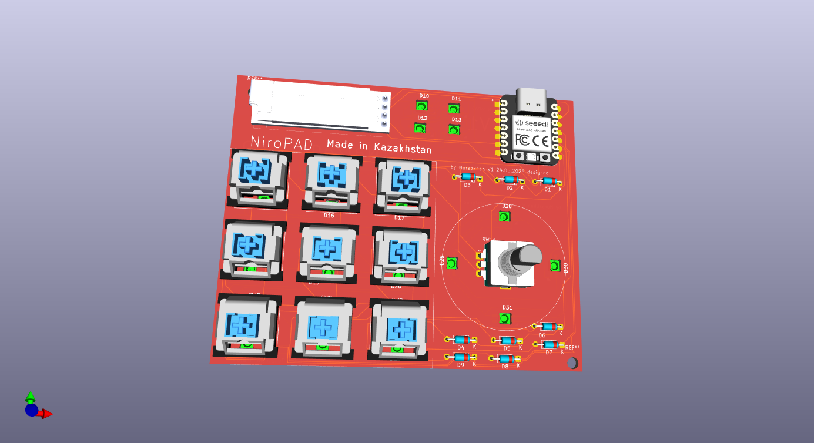

# First Entry

I started from Idea, at first I wanted to make interesting design 

I thought it will be unique to me, and I can even play games as it includes 2 encoders, 9 buttons, display and LEDs. I planned to use LEDs not only behind keyboard, but as indicator of level and so on, so I placed several near display.

But when I started making schematics, I found that I cant fit all this together as there only 11 pins. Also, I learned about button matrix, interesting actually. After little search I found actually there are ways to include the encoder itself as an switch in button matrix, but I also found that it might cause problems. Eventually, I decided to remove second encoder, and changed design.
This design is more similar to ones you find in gallery.
But the main uniqueness was in 2 buttons near display and indicators all over the place.
I tried that and made button matrix of 4columns and 3 rows. but again found out that I can not add column 4 or I should remove LEDs. Column 4 was responsible for 2 switches near display and encoder switch. Though I really wanted to add encoder switch, I had to make choice. My choice was to leave LEDs.
Just for reminder 
Encoder needs 3 pins, (when switch used for matrix)
Leds only 1
Switch matrix 3x3 needs 6 pins
Display needs 2.
I didnt use encoder switch so it took only 2. Finally 2 +1+6+2=11 all pins are used.

So final design looked like this 

Then I assigned footprints, mostly from Kicad builtin library and from care package.
The resources told to use 4pin header for oled, but I used actualy footprint so I won't mess up with sizes.

The pcb routing actually was hardest tasks. I had so many components had to fit in 80*100mm.
As expected from me now, I am not pro and my main task was to connect, even if not perfectly.
Though I tried to shorten routes, don't place them too close to each other, there are long routes that are close to each other.

I multiple times doubted my decision of choosing LEDs. They were all over the place, and they stood behing longest routes. Nevertheless, I could finish it. Finally, I added 3D model to each footprint, mostly searched from grabCAD. I Wanted to see my PCB in 3d.
I didn't knew how to update footprint 3d models, I though making it manually but when I saw 20 leds, I searched for better way , and actually found that there were actually function for that.

Finally, my pcb